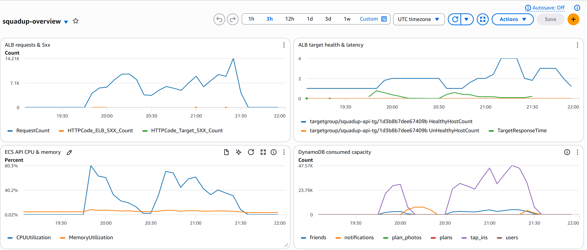
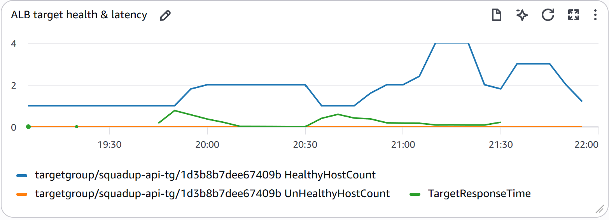
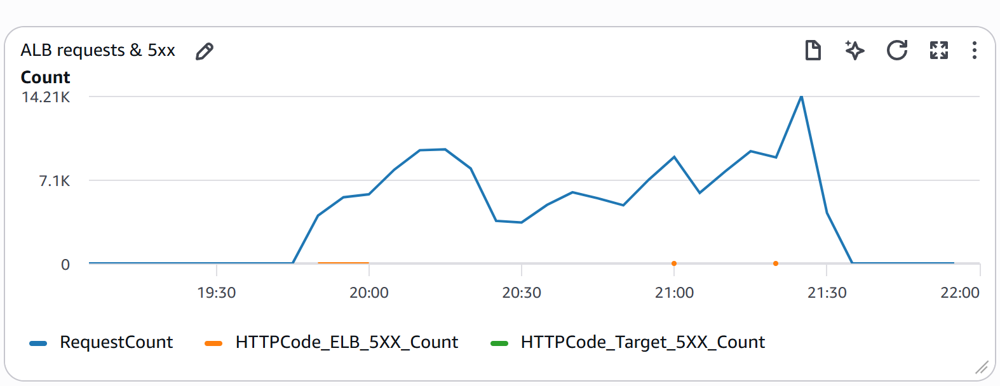

# Resilience experiment results

## resilience_20260529-232631_report.json
- Task killed after: 90 s load
- ALB unhealthy → healthy recovery: **8 s**
- k6 summary: `load-tests/results/resilience/resilience_20260529-232631.json`
- Post-failover p95: 681 ms, fail rate: 0.00%

