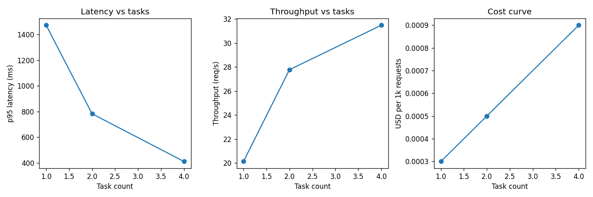

# Scale-out analysis

## 1 task(s) (n=5)
- p95 latency: 1472.6 ms [1409.2, 1536.0] 95% CI
- throughput: 20.12 req/s
- cost per 1k requests: $0.0003

## 2 task(s) (n=5)
- p95 latency: 782.7 ms [625.5, 939.8] 95% CI
- throughput: 27.77 req/s
- cost per 1k requests: $0.0005

## 4 task(s) (n=5)
- p95 latency: 411.3 ms [355.6, 467.0] 95% CI
- throughput: 31.48 req/s
- cost per 1k requests: $0.0009

## Linear scaling region
- 2 tasks: throughput 27.8 req/s vs linear expectation 40.2 (69% of ideal)
- 4 tasks: throughput 31.5 req/s vs linear expectation 80.5 (39% of ideal)

